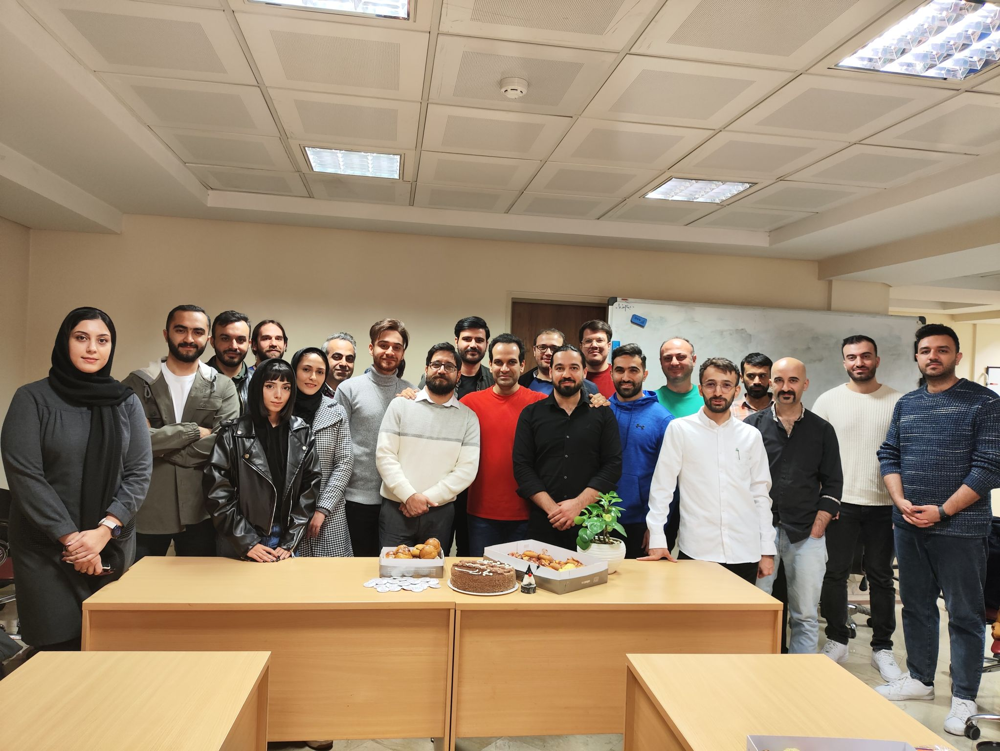
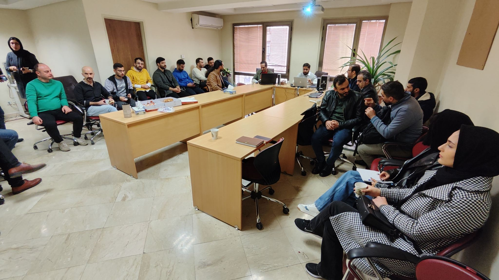
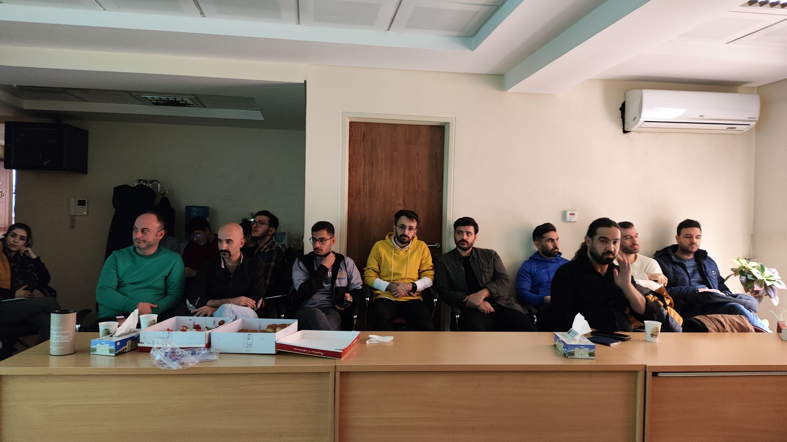
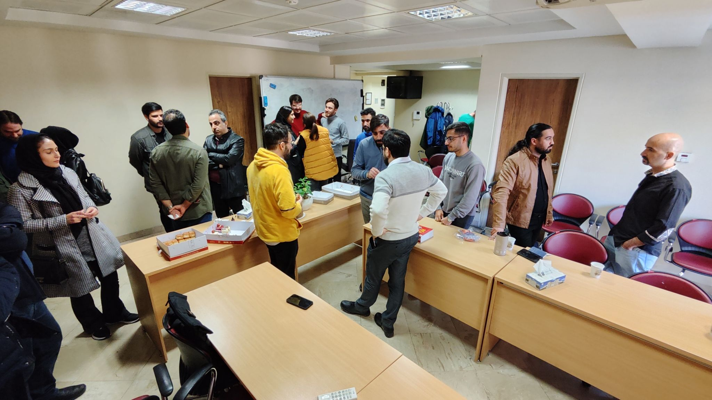
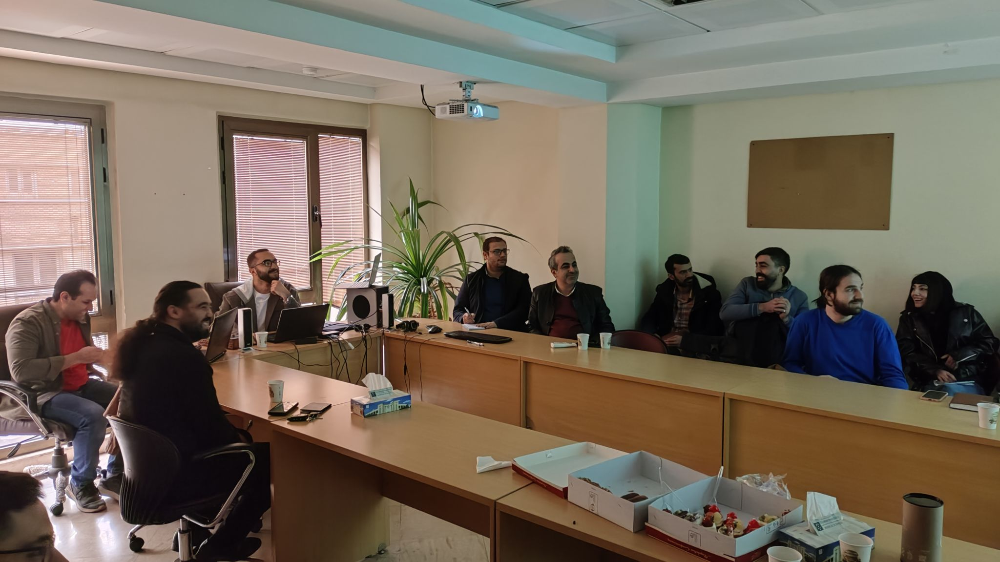

 

این نشست آخرین نشست جاگ در سال 1402 بود که با حضور جمعی از اعضای جاگ تشکیل شد.

در ابتدای نشست برای آشنایی بیشتر اعضای تازه‌ وارد یک معرفی کلی انجام شد و هر کدام از اعضا توضیح کوتاهی درباره‌ی چالش‌هایی که حین کار با آنها روبرو می‌شوند ارائه دادند. این بخش از نشست با همراهی آقای حسام غیاثی برگزار شد. 
 
 
بعد از آشنایی اولیه، آقای مجید مصطفی توضیحات بسیار جالب و مفیدی درباره‌ی تاریخچه‌ی جاوا و اتفاقاتی که بعد از خرید شرکت سان مایکروسیستمز توسط اوراکل افتاد ارائه کردند. در ادامه‌ی ارائه موضوعات مربوط به Microprofile و اهمیت آن مورد بررسی قرار گرفت. موضوع‌های مورد بحث :‌
- تعریف اولیه درباره‌ی  Microprofile
- اهمیت  Microprofile و پیاده‌سازی های آن
- فرصت‌هایی که  Microprofile در آینده‌‌‌ برای برنامه‌نویسان جاوا فراهم می‌کند.
  
در ادامه بعد از کمی استراحت و گپ و گفت، موضوعات مربوط به  microprofle تکمیل شد و در رابطه با Jakarta, Helidon و ... توضیحاتی داده شد.

در بخش پایانی آقای امین بازگیر توضیحاتی درباره‌ی چگونگی مشارکت اعضا در بروزرسانی محتویات سایت ارائه کردند. 

بعد از اتمام نشست پذیرایی به عمل آمد و اعضاء شروع به گفت و گو با یکدیگر کردند. 

    
    
    
    

